# Cyclona Adaptive Training System - Integriertes Konzept

## Status: KONZEPT - IN DISKUSSION
**NICHT IMPLEMENTIEREN** - Dieses Dokument vereint drei Ansätze zu einem Gesamtkonzept.

---

## Übersicht: Die drei Komponenten

1. **Weekly Duration & Slots System** - Wochenvolumen + Zeitfenster-Management
2. **Workout Library (120 Workouts)** - Strukturierte Trainingseinheiten
3. **Adaptive Engine** - KI-gestützte tagesaktuelle Anpassung

---

# TEIL 1: Weekly Duration & Slots System

## Grundprinzip

### Input vom User:
1. **Standard-Wochendauer (Maximum)**: z.B. 10 Stunden
2. **Zeitslots mit Maximaldauern**: z.B. Mo 60min, Mi 90min, Fr 60min, Sa 120min

### Output der App:
- Intelligente Verteilung der Wochendauer auf die Slots
- **Constraint**: Nie mehr als festgelegte Wochendauer
- **Constraint**: Einzeltraining nie länger als Slot-Maximum
- **Flexibilität**: App kann weniger planen für optimale Recovery

### Beispiel:
```
User-Input:
  - Wochendauer-Maximum: 10h (600min)
  - Slots: Mo 60min, Mi 90min, Fr 60min, Sa 120min
  
App-Planung (Woche 1, Base Phase):
  - Montag: 50min LIT (83% Slot-Auslastung)
  - Mittwoch: 75min LIT (83% Slot-Auslastung)
  - Freitag: 45min LIT (75% Slot-Auslastung)
  - Samstag: 110min LIT (92% Slot-Auslastung)
  → Total: 4h 40min (47% des Maximums genutzt)
  
App-Planung (Woche 8, Build Phase):
  - Montag: 60min HIT (100% Slot-Auslastung)
  - Mittwoch: 90min Tempo (100% Slot-Auslastung)
  - Freitag: 50min LIT (83% Slot-Auslastung)
  - Samstag: 120min LIT (100% Slot-Auslastung)
  → Total: 5h 20min (53% des Maximums genutzt)
```

---

# TEIL 2: Workout Library Integration

## Struktur

120 vordefinierte Workouts in 7 Kategorien:
- **LIT** (15 Workouts): 60-150min, 60-75% FTP
- **TEMPO** (15 Workouts): 55-85min, 80-92% FTP
- **FTP** (15 Workouts): 60-85min, 95-105% FTP
- **VO2MAX** (15 Workouts): 45-60min, 110-125% FTP
- **ANAEROBIC** (15 Workouts): 30-60min, 140-180% FTP
- **NEUROMUSCULAR** (15 Workouts): 35-50min, max effort
- **SKILL** (30 Workouts): 40-65min, variabel

## Workout-Auswahl-Logik

```
Schritt 1: Kategorie bestimmen (aus Trainingsphase + Wochenmix)
Schritt 2: Verfügbare Zeit prüfen (Slot-Dauer)
Schritt 3: Passende Workouts filtern (duration <= slot_max)
Schritt 4: Workout auswählen (basierend auf Progression, Abwechslung, etc.)
Schritt 5: Mikro-Anpassung (siehe Adaptive Engine)
```

### Beispiel:
```
Slot: Mittwoch 90min
Phase: Build
Ziel-Kategorie: TEMPO (Sweet Spot)

Passende Workouts:
  - tempo_01_2x20_sweet_spot (60min) ✅
  - tempo_02_3x15_sweet_spot (75min) ✅
  - tempo_03_4x10_sweet_spot (70min) ✅
  - tempo_06_3x20_tempo_85 (85min) ✅
  
Auswahl: tempo_06_3x20_tempo_85 (85min)
Grund: Maximale Slot-Nutzung, passt zur Build-Phase
```

---

# TEIL 3: Adaptive Engine - Tagesaktuelle KI-Anpassung

## Hybrid-Ansatz

**Makro-Ebene (Deterministisch)**:
- Wochenstruktur aus wissenschaftlichen Prinzipien
- Kategorieverteilung nach Phase (Base/Build/Peak/Taper)
- Progression über Wochen

**Mikro-Ebene (KI-gesteuert)**:
- Tagesaktuelle Anpassung basierend auf Readiness
- Workout-Parameter-Variation
- Sicherheits-Guardrails

## Entscheidungsfluss (Täglich)

```mermaid
flowchart TD
  A[Start: Tagescheck] --> B{Daten vollständig?}
  B -- Nein --> B1[Fallback: Geplantes Workout aus Wochenplan] --> J[Workout bereit]
  B -- Ja --> C[Readiness Score berechnen]
  C --> D{TSB < -25 oder Injury?}
  D -- Ja --> D1[HIT sperren, nur Recovery/LIT] --> H[Parameterisierung]
  D -- Nein --> E[Makro: Kategorie aus Wochenmix]
  E --> F[Workout aus Bibliothek wählen]
  F --> G[Kontext prüfen: Slot-Dauer, Indoor/Outdoor, Wetter]
  G --> H[KI-Mikrovariation anwenden]
  H --> I[Guardrails prüfen: TSS-Kappe, Slot-Limit, Sicherheit]
  I --> J[Export: ZWO + Begründung]
```



## Readiness Score

### Input-Daten:
```typescript
interface DailyReadiness {
  // Physiologisch
  hrv_ms: number;              // HRV in Millisekunden
  resting_hr: number;          // Ruhepuls in bpm
  hrv_zscore: number;          // vs. 30-Tage-Baseline
  
  // Subjektiv
  sleep_duration_h: number;    // Schlafdauer
  sleep_quality_score: number; // 0-100 (Whoop/Oura/Garmin)
  soreness_score: number;      // 0-10 (Muskelkater)
  stress_score: number;        // 0-10 (Alltag)
  freshness_rpe: number;       // 0-10 (gefühlte Frische)
  
  // Flags
  injury_flag: boolean;        // Verletzung aktiv
  illness_flag: boolean;       // Krank
  
  // Optional
  menstrual_phase?: string;    // für weibliche Athleten
}
```

### Berechnung:
```typescript
readiness = 
  + z_score(HRV)                    // Höher = besser
  - z_score(resting_HR)             // Niedriger = besser
  + normalize(sleep_quality, 0-100) // 0-1
  - normalize(soreness, 0-10)       // 0-1
  + normalize(freshness_rpe, 0-10)  // 0-1

// Ergebnis: -2.0 bis +2.0
// < -1.0  : Schlecht erholt → Reduktion
// -1 .. +1: Normal → Plan wie vorgesehen
// > +1.0  : Super erholt → Potenzielle Steigerung
```

## Mikro-Anpassungen

### FTP-Skalierung:
```typescript
if (readiness < -1.0) {
  ftp_scale = 0.90;  // 10% Reduktion
  reduce_reps_by = 1; // Ein Intervall weniger
} else if (readiness > +1.0) {
  ftp_scale = 1.02;  // 2% Steigerung
  maybe_increase_reps_by = 1; // Optional ein Intervall mehr
} else {
  ftp_scale = 0.98;  // Leicht konservativ
}
```

### Beispiel:
```
Geplantes Workout: 4x4 VO2 (Seiler) @ 120% FTP

Readiness Score: -1.3 (schlecht geschlafen, HRV niedrig)

Angepasstes Workout: 4x3:30 VO2 @ 115% FTP
  - Dauer pro Intervall: -30s
  - Intensität: -5% FTP
  - Begründung: "HRV niedrig, Schlaf 5:45h → Fokus auf Qualität statt Quantität"
```

## Guardrails (Sicherheit)

### Harte Grenzen:
```typescript
// 1. Verletzung/Krankheit
if (injury_flag || illness_flag) {
  block_categories = ["VO2MAX", "ANAEROBIC", "FTP", "NEUROMUSCULAR"];
  only_allow = ["RECOVERY", "LIT"];
}

// 2. Überlastung (TSB)
if (TSB < -25) {
  block_categories.push("VO2MAX", "ANAEROBIC");
  max_intensity = "TEMPO";
}

// 3. TSS-Kappe
max_daily_tss = Math.min(
  1.6 * ATL,                    // Nicht mehr als 60% über normalem Tag
  weekly_tss_remaining / days_left
);

// 4. Slot-Dauer
workout_duration <= slot_max - buffer_min;

// 5. Wochendauer
sum(week_workouts) <= weekly_duration_max;
```

---

# INTEGRIERTER WORKFLOW: Vom Setup zum fertigen Workout

## Phase 1: User-Setup (einmalig)

### Schritt 1: Profil erstellen
```typescript
interface AthleteProfile {
  // Physiologie
  ftp: number;           // 270W
  weight_kg: number;     // 75kg
  max_hr: number;        // 185bpm
  lthr: number;          // 165bpm
  age: number;           // 35
  sex: 'male' | 'female';
  
  // Präferenzen
  indoor_outdoor_preference: 'indoor' | 'outdoor' | 'auto';
  available_platforms: ['zwift', 'mywhoosh', 'outdoor'];
}
```

### Schritt 2: Wochendauer & Slots definieren
```typescript
interface WeeklyTemplate {
  standard_duration_hours: number; // 10h (MAXIMUM)
  
  slots: Array<{
    day: 'monday' | 'tuesday' | ... ;
    time_start: string;    // '06:00'
    time_end: string;      // '07:00'
    max_duration_min: number; // 60
    location: 'home' | 'gym' | 'outdoor';
  }>;
}

// Beispiel:
weekly_template = {
  standard_duration_hours: 10,
  slots: [
    { day: 'monday',    time: '06:00-07:00', max_duration_min: 60, location: 'home' },
    { day: 'wednesday', time: '18:00-19:30', max_duration_min: 90, location: 'home' },
    { day: 'friday',    time: '06:00-07:00', max_duration_min: 60, location: 'home' },
    { day: 'saturday',  time: '08:00-10:00', max_duration_min: 120, location: 'outdoor' }
  ]
}
```

### Schritt 3: Ziele & Events
```typescript
interface Goal {
  name: string;              // "Alpen-Traum Etappenrennen"
  date: Date;                // 2026-07-15
  priority: 'A' | 'B' | 'C'; // A = Hauptziel
  discipline: 'road' | 'tt' | 'gravel' | 'mtb';
  duration_est_min: number;  // 180min
  course_profile: 'flat' | 'rolling' | 'climb';
}
```

## Phase 2: Makro-Planung (monatlich/wöchentlich)

### Schritt 1: Periodisierung
```typescript
// Berechne Trainingsphase basierend auf Event-Datum
const weeks_to_event = calculateWeeksToEvent(goal.date);

if (weeks_to_event > 16) {
  phase = 'BASE';
  lit_percentage = 80;
  tempo_percentage = 15;
  hit_percentage = 5;
} else if (weeks_to_event > 8) {
  phase = 'BUILD';
  lit_percentage = 60;
  tempo_percentage = 20;
  ftp_percentage = 10;
  vo2_percentage = 10;
} else if (weeks_to_event > 2) {
  phase = 'PEAK';
  lit_percentage = 40;
  tempo_percentage = 20;
  ftp_percentage = 20;
  vo2_percentage = 15;
  anaerobic_percentage = 5;
} else {
  phase = 'TAPER';
  lit_percentage = 60;
  tempo_percentage = 20;
  ftp_percentage = 15;
  vo2_percentage = 5;
  // Volumen reduziert auf 50-60%
}
```

### Schritt 2: Wochenstruktur erstellen
```typescript
function planWeek(
  week_number: number,
  phase: TrainingPhase,
  weekly_duration_max: number,
  slots: TimeSlot[],
  current_ctl: number,
  current_atl: number,
  current_tsb: number
): WeekPlan {
  
  // 1. Ziel-TSS für die Woche
  const target_weekly_tss = calculateWeeklyTSS(current_ctl, phase, week_number);
  
  // 2. Kategorien auf Tage verteilen
  const category_distribution = distributeCategoriesAcrossSlots(
    slots,
    phase,
    lit_percentage,
    tempo_percentage,
    // ...
  );
  
  // 3. Volumen-Checks
  let planned_duration = 0;
  const week_plan: DayPlan[] = [];
  
  for (const slot of slots) {
    const category = category_distribution[slot.day];
    const available_time = Math.min(
      slot.max_duration_min,
      (weekly_duration_max * 60) - planned_duration
    );
    
    // Workout aus Bibliothek wählen
    const workout = selectWorkoutFromLibrary(
      category,
      available_time,
      phase
    );
    
    week_plan.push({
      day: slot.day,
      slot: slot,
      planned_category: category,
      planned_workout_id: workout.id,
      planned_duration_min: workout.duration_min,
      planned_tss: workout.estimated_tss
    });
    
    planned_duration += workout.duration_min;
  }
  
  // 4. Guardrail: Nicht mehr als weekly_duration_max
  if (planned_duration > weekly_duration_max * 60) {
    // Reduziere Workouts oder wähle kürzere Varianten
    adjustWeekPlanToFitDuration(week_plan, weekly_duration_max);
  }
  
  return { week_number, phase, days: week_plan, total_duration_min: planned_duration };
}
```

## Phase 3: Mikro-Anpassung (täglich)

### Schritt 1: Readiness Check (morgens)
```typescript
async function dailyCheck(user_id: string, date: Date): Promise<DayPlan> {
  // 1. Hole geplantes Workout
  const planned = await getPlannedWorkout(user_id, date);
  
  // 2. Hole Readiness-Daten
  const readiness = await getReadinessData(user_id, date);
  
  // 3. Hole aktuelle Fitness
  const fitness = await getCurrentFitness(user_id); // CTL, ATL, TSB
  
  // 4. Prüfe Guardrails
  if (readiness.injury_flag || readiness.illness_flag) {
    return {
      status: 'REST_DAY',
      reason: 'Verletzung/Krankheit erkannt',
      recommendation: 'Pausiere heute und erhol dich!'
    };
  }
  
  if (fitness.tsb < -25) {
    // Überlastet
    if (planned.category in ['VO2MAX', 'ANAEROBIC', 'FTP']) {
      return replaceWorkoutWithRecovery(planned, 'TSB zu niedrig');
    }
  }
  
  // 5. Berechne Readiness Score
  const score = calculateReadinessScore(readiness);
  
  // 6. Workout-Anpassung
  const adapted_workout = adaptWorkout(
    planned.workout_id,
    score,
    readiness,
    fitness
  );
  
  return adapted_workout;
}
```

### Schritt 2: Workout-Parameterisierung
```typescript
function adaptWorkout(
  workout_id: string,
  readiness_score: number,
  readiness: DailyReadiness,
  fitness: CurrentFitness
): AdaptedWorkout {
  
  // Lade Basis-Workout aus Bibliothek
  const base_workout = WORKOUT_LIBRARY[workout_id];
  
  // Initialisiere Anpassungen
  let ftp_scale = 1.0;
  let reps_delta = 0;
  let duration_delta_sec = 0;
  let reasons: string[] = [];
  
  // Readiness-basierte Anpassung
  if (readiness_score < -1.0) {
    ftp_scale = 0.90;
    reps_delta = -1;
    duration_delta_sec = -30;
    reasons.push(`Readiness niedrig (HRV: ${readiness.hrv_zscore.toFixed(1)}σ)`);
    reasons.push(`Schlaf: ${readiness.sleep_duration_h}h`);
  } else if (readiness_score > 1.0) {
    ftp_scale = 1.02;
    // Optional: reps_delta = +1 (nur wenn kein Event bald)
    reasons.push('Super erholt - leichte Steigerung');
  }
  
  // TSB-basierte Anpassung
  if (fitness.tsb < -15) {
    ftp_scale *= 0.95;
    reasons.push(`Form niedrig (TSB: ${fitness.tsb})`);
  }
  
  // Workout anpassen
  const adapted = {
    ...base_workout,
    ftp_scale,
    reps_adjusted: base_workout.repeats + reps_delta,
    interval_duration_adjusted: base_workout.work_s + duration_delta_sec,
    reasons,
    explanation: generateExplanation(reasons)
  };
  
  return adapted;
}
```

### Schritt 3: Export & Kommunikation
```typescript
function exportWorkout(adapted: AdaptedWorkout, user: AthleteProfile): WorkoutExport {
  // 1. ZWO-File generieren (Zwift/MyWhoosh)
  const zwo = generateZWO(adapted, user.ftp);
  
  // 2. User-Message
  const message = `
    🎯 Heute: ${adapted.name}
    ⏱️ Dauer: ${adapted.duration_min} min
    📊 TSS-Ziel: ${adapted.estimated_tss}
    
    ${adapted.explanation}
    
    💡 Begründung:
    ${adapted.reasons.map(r => `  • ${r}`).join('\n')}
  `;
  
  // 3. Push zu Plattform
  if (user.available_platforms.includes('zwift')) {
    await pushToZwift(user.zwift_id, zwo);
  }
  
  return {
    zwo_file: zwo,
    message,
    platform_links: generatePlatformLinks(adapted)
  };
}
```

## Phase 4: Post-Workout (abends)

```typescript
async function processCompletedWorkout(
  user_id: string,
  date: Date,
  workout_data: CompletedWorkout
): Promise<void> {
  
  // 1. Speichere Completion
  await saveCompletion(user_id, date, {
    planned_workout_id: workout_data.planned_id,
    actual_tss: workout_data.tss,
    actual_duration_min: workout_data.duration_min,
    compliance: workout_data.compliance, // 0-1
    avg_power: workout_data.avg_power,
    np: workout_data.normalized_power,
    avg_hr: workout_data.avg_hr,
    hr_drift: calculateHRDrift(workout_data.hr_data),
    rpe: workout_data.rpe
  });
  
  // 2. Update CTL/ATL/TSB
  await updateFitnessMetrics(user_id, workout_data.tss);
  
  // 3. Lern-Feedback für KI
  await logAdaptationOutcome(user_id, {
    readiness_score: workout_data.readiness_score,
    adaptation_applied: workout_data.adaptation,
    actual_compliance: workout_data.compliance,
    actual_rpe: workout_data.rpe,
    hr_drift: workout_data.hr_drift
  });
  
  // 4. Re-Plan wenn nötig
  if (workout_data.compliance < 0.7) {
    // Workout nicht abgeschlossen
    await adjustRestOfWeek(user_id, date, 'reduce_load');
  }
}
```

---

# DATENMODELL: Firestore-Struktur

## Collections

```typescript
/users/{userId}/
  
  // Profil
  /profile/main
    - ftp, weight_kg, max_hr, lthr, age, sex
    - zones_model, indoor_outdoor_preference
    - created_at, updated_at
  
  // Wöchentliches Template
  /availability/weekly_template
    - standard_duration_hours: 10
    - slots: Array<TimeSlot>
    - updated_at
  
  // Ziele & Events
  /goals/{goalId}
    - name, date, priority, discipline
    - course_profile, duration_est_min
  
  // Tägliche Readiness
  /metrics_daily/{YYYY-MM-DD}
    - hrv_ms, resting_hr, hrv_zscore
    - sleep_duration_h, sleep_quality_score
    - soreness_score, stress_score, freshness_rpe
    - injury_flag, illness_flag
    - created_at (auto vom Wearable)
  
  // Aktuelle Fitness
  /fitness/current
    - ctl, atl, tsb
    - updated_at (nach jedem Workout)
  
  // Makro-Pläne (Wochen)
  /plans_weekly/{week_YYYY-WW}
    - phase, weeks_to_event
    - target_weekly_tss, planned_duration_min
    - days: Array<DayPlan>
  
  // Mikro-Pläne (Tage)
  /plans_daily/{YYYY-MM-DD}
    - slot, planned_category, planned_workout_id
    - adapted: boolean
    - adaptation: { ftp_scale, reps_delta, reasons }
    - status: 'planned' | 'adapted' | 'completed' | 'skipped'
    - export: { zwo_url, message }
  
  // Completions
  /completions/{YYYY-MM-DD}
    - planned_workout_id, actual_tss, actual_duration_min
    - compliance, avg_power, np, avg_hr, hr_drift, rpe
    - strava_activity_id
    - completed_at
  
  // Workout Library (shared)
  /workouts_library/cyclona_intervals_v3
    - version: "3.0"
    - workouts: { [id]: Workout }
    - categories: { ... }
```

---

# OFFENE FRAGEN & INTEGRATIONS-CHALLENGES

## A. Wochendauer & Slots

### A1. UI/UX für Slot-Definition
**Frage**: Wie definiert der User die Zeitslots?
- Option 1: Kalender-Interface mit Drag & Drop
- Option 2: Formular "Tag + Startzeit + Endzeit"
- Option 3: Template "Wähle aus vorgefertigten Mustern"

**Empfehlung**: ?

### A2. Slot-Variabilität
**Frage**: Können Slots wöchentlich variieren?
- Beispiel: "In Woche 5-8 andere Zeiten wegen Urlaub"
- Wenn ja: Wie UI gestalten?
- Wenn nein: Wie mit Ausnahmen umgehen?

**Empfehlung**: ?

### A3. Mehrere Slots pro Tag
**Frage**: Darf die App ZWEI Trainings an einem Tag planen?
- Beispiel: Mo 60min früh + Mo 45min abend
- Oder: Maximal EIN Training pro Tag?

**Empfehlung**: ?

### A4. Kommunikation bei Unterauslastung
**Frage**: User plant 10h, App nutzt nur 7h. Wie kommunizieren?
- "Für optimale Recovery plane ich diese Woche nur 7h statt 10h"
- Sichtbar im Dashboard?
- Warnung bei zu wenig Nutzung über mehrere Wochen?

**Empfehlung**: ?

### A5. Edge Case: Zu wenig Slots
**Frage**: Was wenn Slots zu klein für Wochenziel?
- Beispiel: 10h Ziel, aber nur 4h Slot-Kapazität
- Warnung im Setup?
- Automatische Reduzierung des Ziels?

**Empfehlung**: ?

## B. Workout Library

### B1. Workout-Skalierung
**Frage**: Kann ein 90min-Workout auf 75min verkürzt werden?
- Einfach kürzen (weniger Intervalle)?
- Intensität erhöhen bei weniger Zeit?
- Oder: Nur exakte Matches aus Bibliothek?

**Empfehlung**: ?

### B2. Progression innerhalb Kategorie
**Frage**: Wie wählt die App zwischen `lit_01_ga1_60` und `lit_02_ga1_90`?
- Progressive Steigerung über Wochen?
- Abwechslung (nicht immer das gleiche)?
- User-Präferenz berücksichtigen?

**Empfehlung**: ?

### B3. Neue Workouts hinzufügen
**Frage**: Kann der User eigene Workouts hinzufügen?
- Pro: Personalisierung
- Contra: Komplexität, Qualitätskontrolle
- Wenn ja: Wie validieren?

**Empfehlung**: ?

### B4. Workout-Feedback
**Frage**: Kann der User Workouts bewerten?
- "Zu schwer" / "Zu leicht" / "Perfekt"
- KI lernt daraus?
- Beeinflusst zukünftige Auswahl?

**Empfehlung**: ?

## C. Adaptive Engine

### C1. Daten-Quellen
**Frage**: Welche Wearables/Apps integrieren?
**Priorität 1** (Must-have):
- Strava (schon integriert)
- Garmin Connect
- Whoop
- Oura Ring

**Priorität 2** (Nice-to-have):
- Apple Health
- Polar Flow
- COROS
- Suunto

**Empfehlung**: ?

### C2. Datenqualität & Fallbacks
**Frage**: Was wenn HRV-Daten fehlen?
- Fallback auf Subjektiv-Input (User-Umfrage)?
- Oder: Deterministischer Plan ohne Anpassung?
- Wie oft dürfen Daten fehlen?

**Empfehlung**: ?

### C3. User-Override
**Frage**: Darf der User die KI-Anpassung ablehnen?
- "Ich fühle mich besser als die Daten zeigen"
- Wie kommunizieren ohne Vertrauen zu verlieren?
- Loggen für spätere Analyse?

**Empfehlung**: ?

### C4. Explainability
**Frage**: Wie viel Erklärung braucht der User?
**Option A (Minimal)**:
- "Heute leicht reduziert wegen Recovery"

**Option B (Detailliert)**:
- "HRV: -1.2σ, Schlaf: 5:45h, TSB: -22 → 10% Reduktion"

**Option C (Wissenschaftlich)**:
- Voller Readiness-Report mit Grafiken

**Empfehlung**: ?

### C5. KI-Training & Verbesserung
**Frage**: Wie lernt die KI aus Completions?
- Supervised Learning auf Compliance-Daten?
- A/B-Testing von Anpassungs-Strategien?
- Wann wird das Modell neu trainiert?

**Empfehlung**: ?

## D. Integration & Workflows

### D1. Wann wird neu geplant?
**Frage**: Timing der Planung
- **Wochenplanung**: Sonntag abends für nächste Woche?
- **Tagesanpassung**: Jeden Morgen um 6:00?
- **Re-Planning**: Bei verpasstem Workout sofort?

**Empfehlung**: ?

### D2. Notifications
**Frage**: Welche Benachrichtigungen?
- "Workout für heute ist bereit" (morgens)
- "Erinnerung: Training in 1h" (vor Slot)
- "HRV niedrig, Training angepasst" (bei Änderung)
- "Wochenplan für nächste Woche verfügbar" (Sonntag)

**Empfehlung**: ?

### D3. Camp & Urlaub
**Frage**: Wie mit Trainings-Camps umgehen?
- Temporär andere Slots?
- Höhere Wochendauer?
- Spezielle "Camp-Modus"-Funktion?

**Empfehlung**: ?

### D4. FTP-Updates
**Frage**: Wie oft FTP neu testen?
- Automatische Vorschläge (alle 6-8 Wochen)?
- AI-Erkennung aus Power-Daten?
- Manuelle Tests (Ramp Test, 2x8min, etc.)?

**Empfehlung**: ?

### D5. Multi-Sport
**Frage**: Unterstützung für Triathlon?
- Swim/Bike/Run in verschiedenen Slots?
- Phase 1: Nur Cycling
- Phase 2: Multi-Sport

**Empfehlung**: Erstmal nur Cycling?

## E. Performance & Skalierung

### E1. Firestore Query-Optimierung
**Frage**: Wie oft lesen wir die Workout-Library?
- Einmal beim App-Start cachen?
- Cloud Function die vorselektiert?
- Edge-Caching für schnellere Zugriffe?

**Empfehlung**: ?

### E2. Cloud Function Kosten
**Frage**: Tägliche Anpassung für 10,000 User = 10,000 Function Calls
- Kosten-Modell akzeptabel?
- Batch-Verarbeitung morgens?
- User kann Zeitpunkt wählen?

**Empfehlung**: ?

### E3. ZWO-Generation
**Frage**: Wo generieren wir ZWO-Files?
- Client-side (schnell, kostenlos)?
- Server-side (konsistent, cachebar)?
- On-Demand oder vorberechnet?

**Empfehlung**: ?

## F. MVP-Scope

### F1. Phase 1 (MVP)
**Must-Have für Launch**:
- [ ] Weekly Duration & Slots Setup
- [ ] Workout Library (120 Workouts)
- [ ] Makro-Planung (deterministisch)
- [ ] Basis-Anpassung (TSB-basiert)
- [ ] ZWO-Export
- [ ] Strava-Sync (bereits vorhanden)

**Optional für MVP**:
- [ ] Readiness-Integration (Garmin/Whoop)
- [ ] KI-Mikroanpassung
- [ ] Wetter-Integration
- [ ] Multi-Goal-Support

### F2. Phase 2 (Enhancement)
**Nach Launch**:
- [ ] Volle KI-Integration
- [ ] Mehrere Wearables
- [ ] Advanced Analytics
- [ ] User-Feedback-Loop
- [ ] Custom Workouts
- [ ] Social Features

**Empfehlung**: ?

---

# MEINE EINSCHÄTZUNG

## 🎯 Konzept-Bewertung: 9/10

### Stärken:
✅ **Wissenschaftlich fundiert** - Kombination aus bewährten Prinzipien (Periodisierung, TSS, CTL/ATL)
✅ **Praktisch** - User gibt klare Constraints (Zeit, Slots), App macht den Rest
✅ **Flexibel** - Kann weniger planen als Maximum (für Recovery)
✅ **Zukunftssicher** - KI-Layer kann schrittweise verbessert werden
✅ **Skalierbar** - Hybrid-Ansatz (Deterministisch + KI) ist robust

### Herausforderungen:
⚠️ **Komplexität** - Viele Moving Parts (Slots, Library, Adaptive Engine)
⚠️ **Datenabhängigkeit** - KI braucht gute Readiness-Daten
⚠️ **UX-Design** - Setup muss einfach sein trotz Komplexität
⚠️ **Testing** - Schwer zu testen (lange Feedback-Loops)

## 🚀 Implementierungs-Strategie

### Empfohlener Rollout:

**Phase 1 (MVP - 4-6 Wochen)**:
1. Weekly Duration & Slots UI
2. Workout Library Integration
3. Deterministische Makro-Planung
4. TSB-basierte Basis-Anpassung
5. ZWO-Export
6. Basic Dashboard

**Phase 2 (Enhancement - 6-8 Wochen)**:
1. Readiness-Integration (Garmin API)
2. KI-Mikroanpassung (einfaches Modell)
3. Wetter-Integration
4. Advanced Explanations

**Phase 3 (Scale - 8-12 Wochen)**:
1. Mehr Wearables
2. ML-Modell-Training
3. User-Feedback-Loop
4. Custom Workouts
5. Social/Community Features

## 💡 Kritische Erfolgsfaktoren

1. **Setup-Flow muss EINFACH sein**
   - Onboarding in < 5 Minuten
   - Gute Defaults
   - Progressive Disclosure (nicht alles auf einmal)

2. **Trust through Transparency**
   - User muss verstehen WARUM die App etwas tut
   - Klare Kommunikation der Anpassungen
   - Override-Möglichkeit

3. **Datenqualität**
   - Validierung von Readiness-Daten
   - Outlier-Detection
   - Graceful Degradation bei fehlenden Daten

4. **Performance**
   - Schnelle Planungs-Algorithmen
   - Caching wo möglich
   - Offline-Funktionalität

## 🎓 Vergleich mit Konkurrenz

**TrainerRoad**: Deterministisch, kein KI, gute Library
**Wahoo SYSTM**: Fixed Plans, kein Adaptive
**Xert**: Adaptive, aber komplex, steile Lernkurve
**Join**: KI-basiert, aber keine Slot-Constraints

**Cyclona = TrainerRoad (Library) + Xert (Adaptive) + Praktische Constraints (Slots)**

---

# NEXT STEPS

## Vor Implementierung klären:

1. **Alle Fragen A1-F2 beantworten**
2. **UI/UX Mockups erstellen** (Setup-Flow, Dashboard)
3. **Datenmodell finalisieren** (Firestore Schema)
4. **MVP-Scope festlegen** (Was muss in v1.0?)
5. **Testing-Strategie** (Wie validieren wir die KI-Anpassungen?)

## Dann Implementation:

1. **Backend**: Firestore Schema + Cloud Functions
2. **Core Logic**: Planungs-Algorithmen + Adaptive Engine
3. **Frontend**: Setup-Flow + Dashboard
4. **Integration**: Wearables + ZWO-Export
5. **Testing**: Unit + Integration + User Testing

---

**Bereit für die Diskussion?** 🚀
