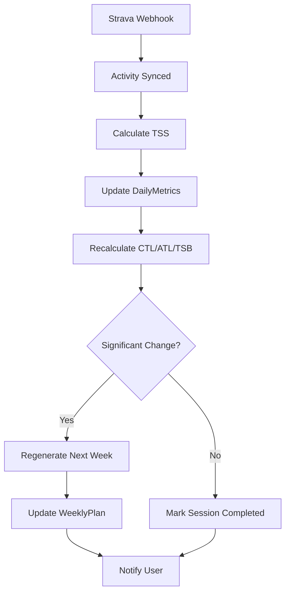

# 🚀 Dynamische Trainingsplan-Erstellung - Roadmap

## 📋 Übersicht

Transformation von **heuristischer** zu **dynamischer ML-gestützter** Trainingsplanung mit automatischer Aktualisierung und Event-Management.

**Ziel:** Vollautomatische, adaptive Trainingsplanung die auf echte Performance reagiert, ML-Vorhersagen nutzt, und Events/Camps intelligent berücksichtigt.

---

## ✅ Status Quo (Was bereits existiert)

### Bereits implementiert:
- ✅ Heuristische Trainingsplan-Generierung (`planGenerator.ts`)
- ✅ Guardrails System (max ramp rate, TSB, HIT back-to-back)
- ✅ SlotManager für Zeitfenster-Zuordnung
- ✅ CampSeasonManager für Events und Camps
- ✅ Strava Integration mit OAuth und Webhooks
- ✅ TSS-Berechnung (Power, HR, RPE-basiert)
- ✅ CTL/ATL/TSB Tracking
- ✅ Firestore Datenmodell komplett
- ✅ ML-Predictor Grundgerüst (`mlPredictor.ts`)
- ✅ ONNX Model-Loader vorbereitet
- ✅ Type System vollständig

### Was fehlt noch:
- ❌ ML-Modell Integration aktiviert und funktionsfähig
- ❌ Automatische Plan-Aktualisierung nach absolviertem Training
- ❌ Dynamische Anpassung basierend auf tatsächlicher Performance
- ❌ Event/Camp-Management in UI
- ❌ Wochenplan-Synchronisation mit definierten Zeitfenstern
- ❌ Prioritäten-Management für Events
- ❌ Multi-Event-Support mit intelligenter Periodisierung

---

## 🎯 Haupt-Anforderungen

### 1. ML-Integration (HÖCHSTE PRIORITÄT)
**Was:** XGBoost-Modell für TSS-Vorhersagen aktivieren

**Umfang:**
- [ ] ONNX-Model aus Firebase Storage laden
- [ ] Feature Engineering implementieren
- [ ] Predictions in `planGenerator.ts` integrieren
- [ ] Fallback auf Heuristik wenn ML nicht verfügbar
- [ ] Hybrid-Ansatz: ML + Guardrails

**Dateien:**
- ✏️ `src/lib/mlPredictor.ts` - Vervollständigen
- ✏️ `src/lib/planGenerator.ts` - ML-Predictions integrieren
- 📦 Firebase Storage - Model uploaden

**Abhängigkeiten:**
- `onnxruntime-node` NPM Package
- `scripts/convert_xgb_to_onnx.py` ausführen
- Model in Firebase Storage hochladen

---

### 2. Automatische Plan-Aktualisierung
**Was:** Nach jeder Aktivität Plan neu berechnen und anpassen

**Umfang:**
- [ ] Webhook-Handler erweitern für Plan-Trigger
- [ ] Cloud Function: `updateTrainingPlanAfterActivity`
- [ ] CTL/ATL/TSB in Echtzeit updaten
- [ ] Nächste Woche automatisch regenerieren
- [ ] Compliance-Tracking einbauen
- [ ] User-Benachrichtigung bei signifikanten Änderungen

**Dateien:**
- 🆕 `functions/src/updateTrainingPlan.ts` - NEU
- ✏️ `functions/src/index.ts` - Webhook erweitern
- ✏️ `src/lib/planGenerator.ts` - Re-planning Logik
- ✏️ `src/lib/fitnessMetrics.ts` - Real-time CTL/ATL/TSB

**Flow:**
```
Strava Webhook → Activity synced → 
Update DailyMetrics → Recalculate CTL/ATL/TSB →
Check Compliance → Adjust next week's plan →
Notify user if significant change
```

---

### 3. Dynamische Anpassung basierend auf Performance
**Was:** Plan passt sich an tatsächliche Leistung an (besser/schlechter als erwartet)

**Umfang:**
- [ ] Performance-Deviation-Tracking (Soll vs. Ist)
- [ ] Automatische FTP-Anpassung bei konstanter Over-/Underperformance
- [ ] Fatigue-Detection (HRV, RPE, TSB)
- [ ] Plan-Anpassung bei Übertraining-Signalen
- [ ] Plan-Anpassung bei Untertraining (zu leicht)

**Dateien:**
- 🆕 `src/lib/performanceAnalyzer.ts` - NEU
- ✏️ `src/lib/planGenerator.ts` - Adaptive Logik
- ✏️ `src/lib/fitnessMetrics.ts` - Fatigue Scores

**Metriken:**
- TSS Soll vs. Ist (±20% = signifikant)
- RPE Durchschnitt (>8 = zu hart, <4 = zu leicht)
- TSB Trend (kontinuierlich negativ = Risiko)
- HRV Trend (fallend = Erholung nötig)

---

### 4. Zeitfenster-Synchronisation
**Was:** Wochenplan nutzt tatsächlich verfügbare Zeitslots (Standard + Overrides)

**Umfang:**
- [ ] `weeklyOverrides` aus UserProfile korrekt laden
- [ ] Standard-Slots vs. wochenspezifische Slots priorisieren
- [ ] Automatische Session-Verschiebung wenn Slot nicht verfügbar
- [ ] UI für Slot-Override-Verwaltung
- [ ] Multi-Session-Days erlauben (z.B. 2x 60min)

**Dateien:**
- ✏️ `src/lib/slotManager.ts` - Override-Logik
- ✏️ `src/lib/planGenerator.ts` - Slot-Aware Planning
- 🆕 `src/app/settings/slots/page.tsx` - UI für Slot-Management

**Logik:**
```typescript
// Pseudo-Code
const availableSlots = weeklyOverrides[weekId] || userProfile.preferences.preferredTrainingTimes;
const sessions = generateSessions(...);
sessions.forEach(session => {
  const slot = slotManager.findBestSlot(availableSlots, session.duration, session.type);
  session.timeSlot = slot;
});
```

---

### 5. Event & Camp Management mit Prioritäten
**Was:** A/B/C-Events intelligent in Periodisierung einbauen

**Umfang:**
- [ ] Event-Kalender UI (Übersicht aller Ziele)
- [ ] Automatische Periodisierung basierend auf A-Events
- [ ] Taper-Phase automatisch generieren
- [ ] Post-Event Erholung einplanen
- [ ] Camps mit Deload-Wochen
- [ ] Multi-Event-Konflikte erkennen und Warnung
- [ ] Prioritäten-basierte Plan-Anpassung

**Dateien:**
- 🆕 `src/app/dashboard/events/page.tsx` - Event-Übersicht
- 🆕 `src/lib/eventManager.ts` - Event-Logik
- ✏️ `src/lib/planGenerator.ts` - Event-aware Planning
- ✏️ `src/lib/slotManager.ts` - Camp-Schedule Generation

**Features:**
- **A-Events:** Build-Peak-Taper Periodisierung (12-16 Wochen)
- **B-Events:** Moderate Taper (7-10 Tage)
- **C-Events:** Keine Taper, normale Woche
- **Camps:** Volumen +20-40%, Deload danach

---

### 6. Wochenausrichtung & Datumslogik
**Was:** ISO-Wochen korrekt behandeln, Montag = Wochenstart

**Umfang:**
- [ ] ISO-Wochennummern durchgehend verwenden
- [ ] `startOfWeek(date, { weekStartsOn: 1 })` überall
- [ ] Wochenübergänge korrekt in UI anzeigen
- [ ] Slot-Day-Mapping (0=Montag, 6=Sonntag) vs. JS (0=Sonntag)
- [ ] Kalender-Integration (Google Calendar Export)

**Dateien:**
- ✏️ Alle Dateien die `date-fns` nutzen
- ✏️ `src/components/WeeklyPlanView.tsx`
- 🆕 `src/lib/dateUtils.ts` - Zentrale Date-Funktionen

---

## 📅 Implementierungs-Phasen

### Phase 1: ML-Integration (JETZT)
**Dauer:** ~2-3 Stunden

1. ✅ ONNX-Model konvertieren und hochladen
2. ✅ `mlPredictor.ts` vervollständigen
3. ✅ ML-Predictions in `planGenerator.ts` integrieren
4. ✅ Tests mit echten Daten
5. ✅ Fallback-Logik verifizieren

**Output:** Funktionierendes ML-basiertes TSS-Prediction

---

### Phase 2: Automatische Updates (HEUTE ABEND)
**Dauer:** ~2-3 Stunden

1. ✅ Cloud Function für Plan-Updates
2. ✅ Webhook-Integration
3. ✅ Real-time Metrics Update
4. ✅ Compliance-Tracking
5. ✅ Notification System

**Output:** Plan aktualisiert sich automatisch nach Aktivitäten

---

### Phase 3: Performance-Adaptation (NÄCHSTE SESSION)
**Dauer:** ~3-4 Stunden

1. ✅ Performance-Analyzer implementieren
2. ✅ Adaptive FTP-Logik
3. ✅ Fatigue-Detection
4. ✅ Plan-Adjustment Algorithmen
5. ✅ UI für Performance-Insights

**Output:** Plan passt sich an echte Leistung an

---

### Phase 4: Event & Camp UI (NÄCHSTE SESSION)
**Dauer:** ~3-4 Stunden

1. ✅ Event-Kalender UI
2. ✅ Camp-Verwaltung UI
3. ✅ Prioritäten-Management
4. ✅ Periodisierungs-Visualisierung
5. ✅ Konflikt-Erkennung

**Output:** Vollständiges Event-Management

---

### Phase 5: Zeitfenster-Verwaltung (SPÄTER)
**Dauer:** ~2 Stunden

1. ✅ Slot-Override UI
2. ✅ Wöchentliche Anpassungen
3. ✅ Multi-Session-Support
4. ✅ Slot-Konflikte visualisieren

**Output:** Flexible Zeitfenster-Verwaltung

---

## 🔧 Technische Details

### ML-Feature-Liste (für Predictions)
```typescript
interface MLFeatures {
  // User-Daten
  ftp: number;
  weight: number;
  age: number;
  
  // Historische Metriken (7-Tage-Fenster)
  tss_lag1: number;      // Gestern
  tss_lag7: number;      // Vor 7 Tagen
  tss_7d: number;        // Summe letzte 7 Tage
  
  // Fitness-Metriken (42-Tage-Fenster)
  ctl_42: number;        // Chronic Training Load
  atl_7: number;         // Acute Training Load
  tsb: number;           // Training Stress Balance
  
  // Zyklische Features
  dow_sin: number;       // Day of week (sin)
  dow_cos: number;       // Day of week (cos)
  woy_sin: number;       // Week of year (sin)
  woy_cos: number;       // Week of year (cos)
  
  // Event-Kontext
  days_to_next_goal: number;
  goal_priority: number; // 3=A, 2=B, 1=C
  in_camp: boolean;
  camp_day: number;      // Tag im Camp (0 wenn nicht im Camp)
}
```

### Automatisches Update-Flow


### Guardrails bei automatischen Updates
```typescript
const AUTO_UPDATE_GUARDRAILS = {
  // Maximale Anpassung pro Update
  maxTssChange: 50,        // ±50 TSS pro Woche
  maxHoursChange: 1,       // ±1 Stunde pro Woche
  
  // Schwellenwerte für Re-Planning
  complianceThreshold: 0.7, // <70% Compliance → Re-plan
  tsbCritical: -30,         // TSB < -30 → Erzwungene Erholung
  
  // Frequenz-Limits
  maxUpdatesPerWeek: 2,     // Nicht öfter als 2x/Woche updaten
  minDaysBetweenUpdates: 3, // Mindestens 3 Tage Abstand
};
```

---

## 📊 Success Metrics

### Messen wir den Erfolg:
1. **ML-Accuracy:** RMSE < 10 TSS zwischen Prediction und Actual
2. **Compliance:** >80% der geplanten Sessions absolviert
3. **Auto-Update-Rate:** >90% der Updates ohne Fehler
4. **User-Satisfaction:** Subjektive Bewertung (zu leicht/zu schwer)
5. **Performance-Gains:** FTP-Steigerung über Zeit

---

## 🚨 Kritische Punkte / Risiken

### 1. ML-Modell-Qualität
- **Risiko:** Modell macht schlechte Predictions
- **Mitigation:** Immer Guardrails anwenden, Fallback auf Heuristik

### 2. Over-Automation
- **Risiko:** User verliert Kontrolle über Plan
- **Mitigation:** Opt-out für Auto-Updates, manuelle Overrides erlauben

### 3. Event-Konflikte
- **Risiko:** Zu viele A-Events zu nah beieinander
- **Mitigation:** Warnung in UI, max 3 A-Events pro Saison empfehlen

### 4. Performance-Daten-Qualität
- **Risiko:** User hat kein Power-Meter → schlechte TSS-Schätzungen
- **Mitigation:** RPE-basiertes TSS als Backup, HRV-Integration

---

## 📝 Offene Fragen (ABKLÄREN VOR START)

1. **ML-Modell:** Ist das `.bst` Model bereits in Firebase Storage? Welcher Path?
2. **Feature-Namen:** Welche Features erwartet dein XGBoost-Modell genau?
3. **Auto-Update:** Soll JEDE Aktivität ein Update triggern oder nur wöchentlich?
4. **Notifications:** Wie sollen User benachrichtigt werden? (In-App, Email, Push?)
5. **Slot-Overrides:** Sollen diese persistent gespeichert werden oder nur temporär?
6. **Event-Limits:** Max. Anzahl A-Events pro Jahr? (Vorschlag: 3-4)
7. **Camp-Deload:** Automatisch oder user-definiert?

---

## 🎯 Erste Schritte (HEUTE)

### 1. Review dieses Dokuments
- ✅ Alle Anforderungen vollständig?
- ✅ Priorisierung korrekt?
- ✅ Offene Fragen klären

### 2. ML-Integration starten
- ✅ Model-Status prüfen
- ✅ ONNX-Konvertierung
- ✅ Integration testen

### 3. Auto-Update implementieren
- ✅ Cloud Function schreiben
- ✅ Webhook erweitern
- ✅ Testen mit echten Daten

---

## 📞 Nächste Schritte

**JETZT:** Dieses Dokument reviewen und offene Fragen klären  
**DANN:** Mit Phase 1 (ML-Integration) starten  
**ZIEL:** Phase 1 + 2 heute fertig bekommen 🚀

---

**Bereit?** Sag Bescheid wenn du soweit bist und wir können loslegen! 💪
